# Приведение к 3 нормальной форме (3NF)

- [Приведение к 3 нормальной форме (3NF)](#приведение-к-3-нормальной-форме-3nf)
  - [Что такое нормальные формы БД?](#что-такое-нормальные-формы-бд)
    - [Первая нормальная форма (1NF)](#первая-нормальная-форма-1nf)
    - [Вторая нормальная форма (2NF)](#вторая-нормальная-форма-2nf)
    - [Третья нормальная форма (3NF)](#третья-нормальная-форма-3nf)
  - [А теперь посмотрим это на практике](#а-теперь-посмотрим-это-на-практике)

## Что такое нормальные формы БД?

Нормальная форма - это набор условий для БД. Если БД соответствует условиям нормальной формы, значит она приведена к этой нормальной форме. Есть много нормальных форм, но нас интересуют только 1, 2 и 3.

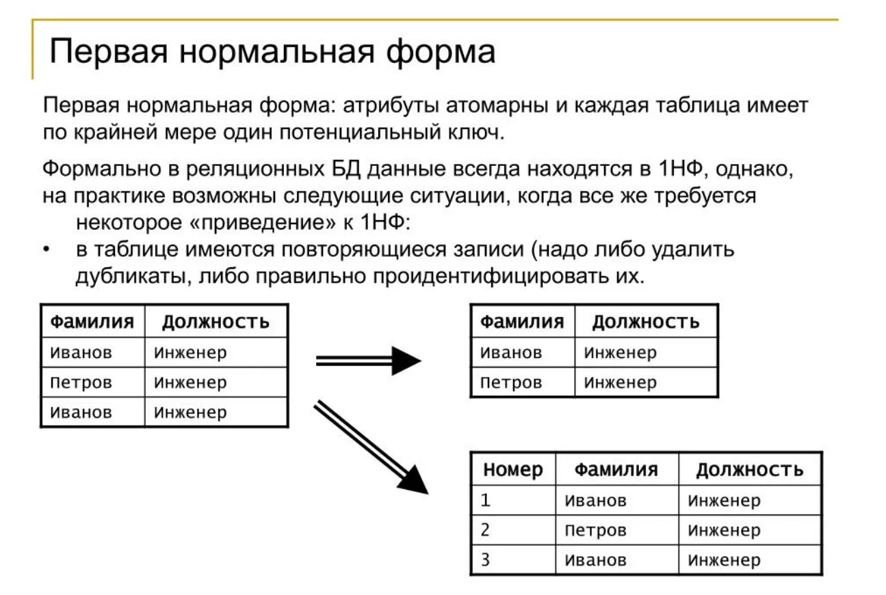
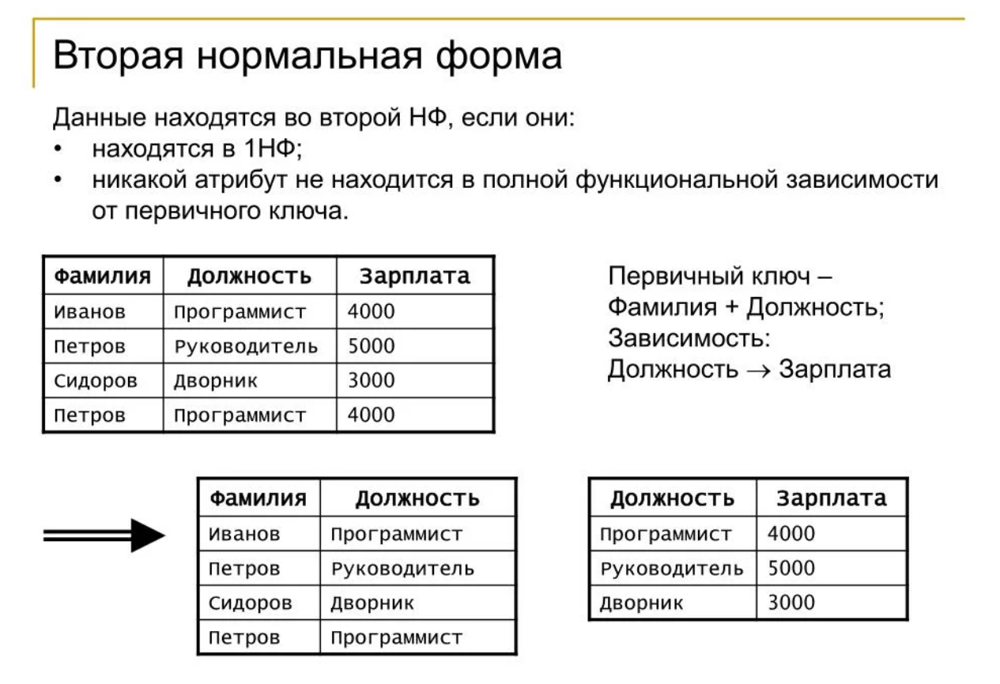
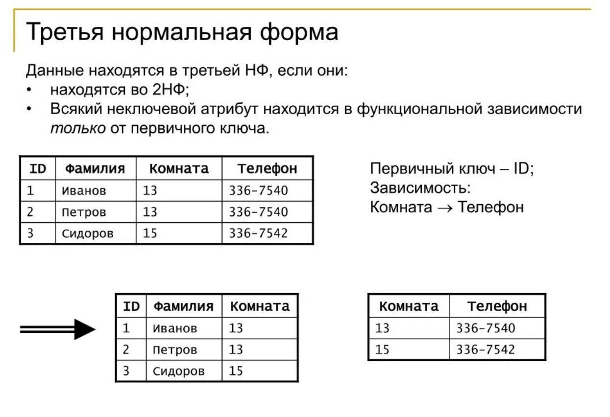

Простыми словами: 

Нормализация — это способ организовать таблицы в базе данных, чтобы убрать повторяющиеся данные и зависимость между полями.

### Первая нормальная форма (1NF)
- Каждая ячейка таблицы содержит только одно значение (атомарность), строки уникальны (то есть, есть первичный ключ) и нет повторяющихся групп колонок (атрибутов). ТО ЕСТЬ, нельзя хранить в одной ячейке список значений, например, несколько номеров телефонов через запятую; каждый факт должен быть в своей строке или колонке.
- Пример: вместо "Телефоны: 111,222" сделать две строки с одним номером или отдельную таблицу телефонов.

### Вторая нормальная форма (2NF)
- Все уже должно быть в 1NF, + все неключевые поля полностью зависят от всего первичного ключа. Если ключ состоит из двух колонок (атрибутов), то каждая другая колонка должна зависеть от ОБЕИХ, а не только от одной из них. Если зависимость частичная — данные надо вынести в другую таблицу.
- Пример: таблица заказов-товаров с ключом (OrderID, ProductID). Поле OrderDate зависит только от OrderID — его нужно вынести в таблицу Orders.

### Третья нормальная форма (3NF)
- Все уже должно быть в 1NF, + никакое неключевое поле не зависит от другого неключевого поля (нет транзитивных зависимостей). ТО ЕСТЬ, нельзя хранить в одной таблице данные, которые зависят не от ключа, а от другого поля. В таком случае создают дополнительную таблицу для этих зависимостей.
- Пример: если в таблице сотрудников есть DepartmentName и DepartmentLocation, а DepartmentLocation определяется через DepartmentName, то создают таблицу Departments с информацией о департаменте и потом в таблице сотрудников указывают внешний ключ на Department.

## А теперь посмотрим это на практике

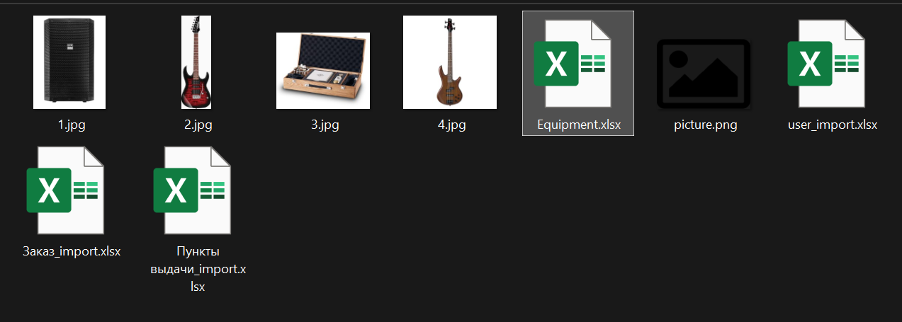

У нас есть 4 таблицы. Откроем первую - "Equipment".

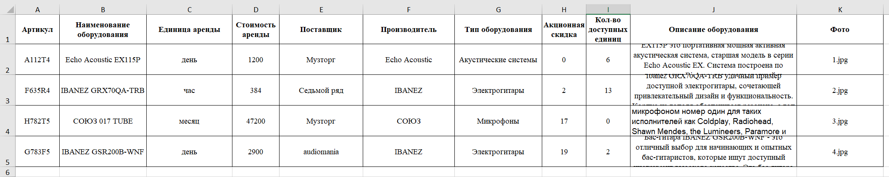

Вот так она выглядит.

Все данные в ячейках уже атомарны, но нет первичного ключа (артикул не первичный ключ, и вообще в идеале у нас первичные ключи должны быть int). Добавим его.

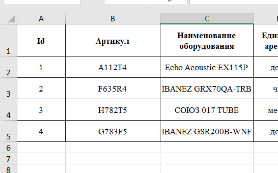

Просто сместим все на один столбец вправо и сделаем столбец Id, где проставим айдишники для всех строк.

А что если у нас будет 10 поставщиков для одного и того же товара? Тогда мы в этой таблице продублируем всю информацию, изменив только поставщика. Это плохо. Чтобы привести к 3NF, нужно вынести некоторую информацию в отдельную таблицу.

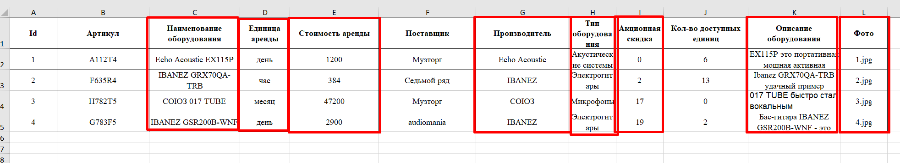

Вынесем это в отдельную таблицу, т.к. данная информация относится только к товарам, а не к производителям и кол-ву на складе.

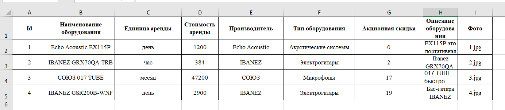

Вот такая таблица у нас получилась.

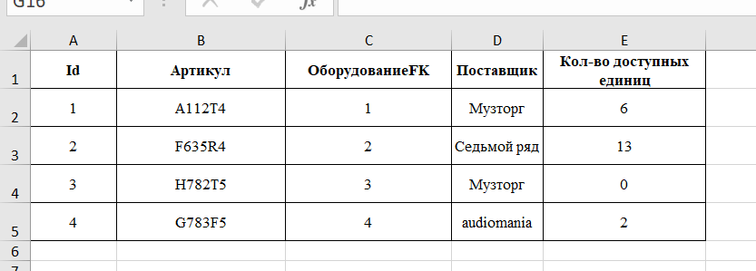

Вернемся к старой таблице, удалим все столбцы, которые мы перенесли в новую таблицу и сделаем новый столбец ("ОборудованиеFK", где FK - Foreign Key, внешний ключ). Туда занесем соответствующие Id оборудования из новой таблицы.

Рассмотрим эту таблицу: У нас повторяется 2 раза "Музторг" в столбце с поставщиком. В теории любой поставщик может здесь повторяться бесконечное количество раз. Это не хорошо. Вдруг поставщик сменит свое название и нам тогда придется 10000000 раз менять его название во всех записях. Нам нужно сделать так, чтобы это название хранилось только в одном месте. Вынесем это в отдельную таблицу.

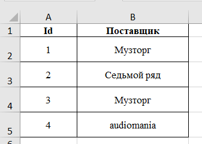

Вот, что у нас получилось. Однако "Музторг" здесь повторяется. Это не ок. Изменим таблицу.

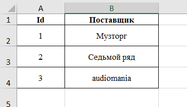

Все, теперь все нормально. Каждая запись отражает одного поставщика.

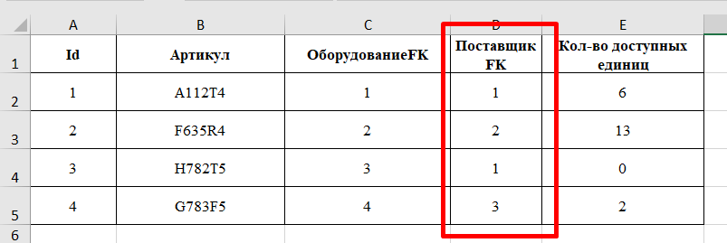

Заменим в предыдущей таблице "Поставщик" на "ПоставщикFK" и заменим "Музторг" на 1, "Седьмой ряд" на 2, "audiomania" на 3 (в соответствии с нашей новой таблицей).

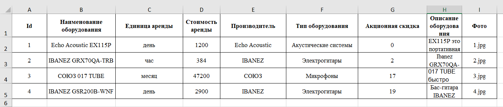

Аналогичная ситуация с производителем, типом оборудования, единицей измерения. Это все нужно вынести с отдельные таблицы, чтобы прийти к 3NF.

Дальнейшие действия выполняются по аналогии с тем, чтобы было написано выше. Выполняется до тех пор, пока все таблицы из бд не будут соответствовать условиям 1, 2 и 3 нормальных форм.