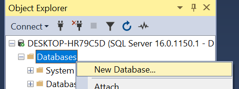
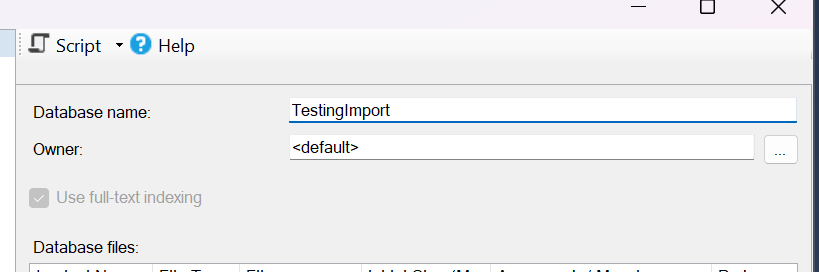
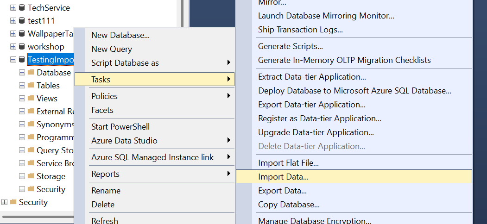
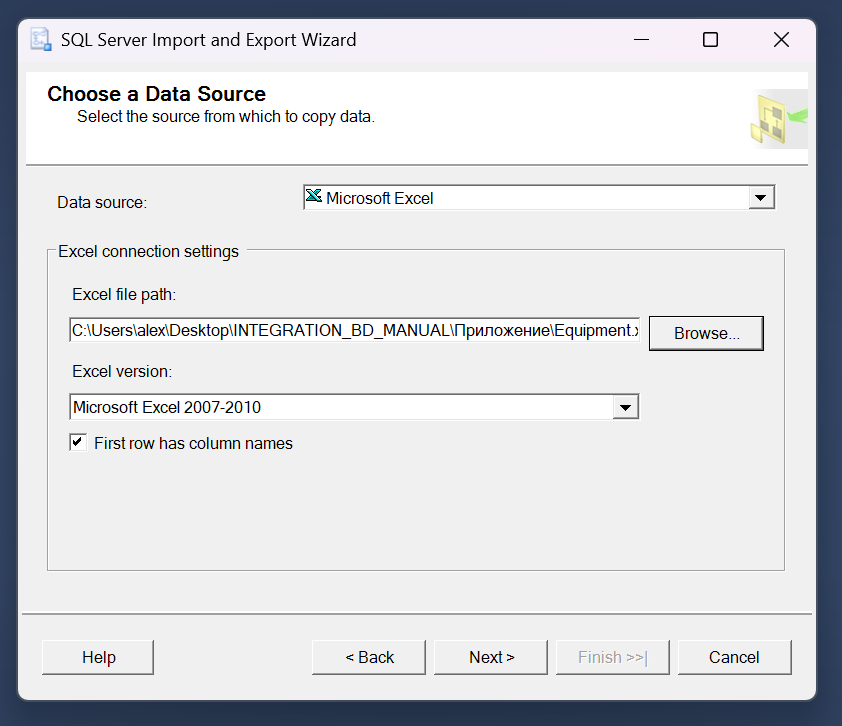
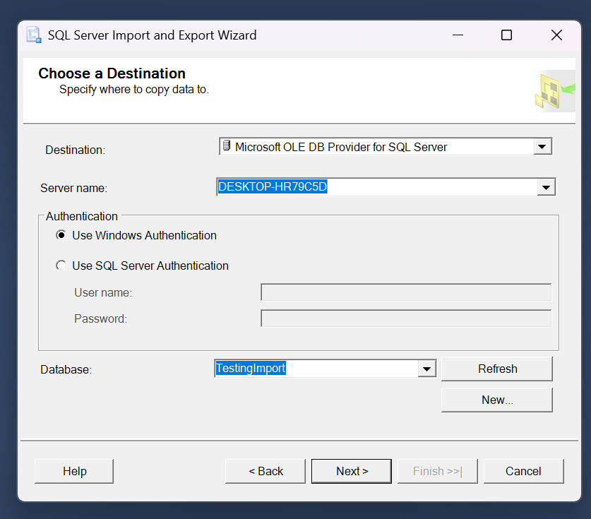
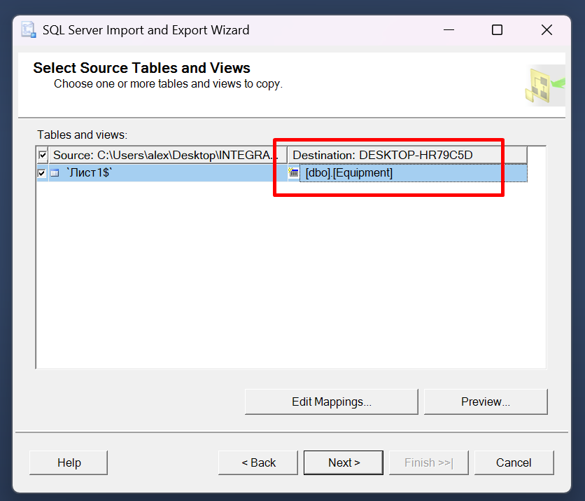
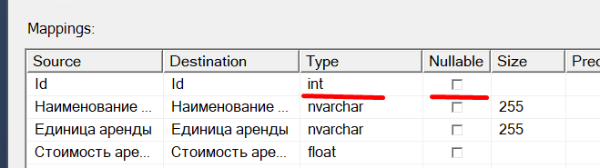
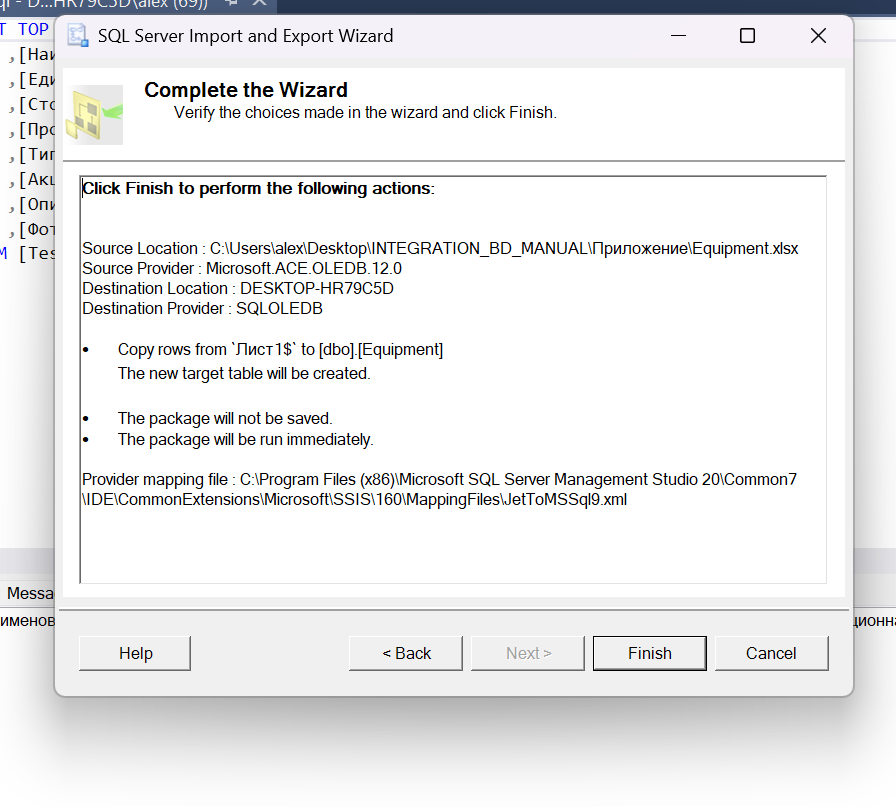
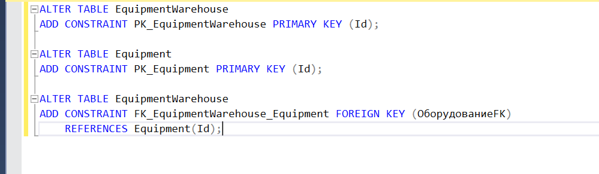

# Импорт таблиц в БД

Открываем сие чудо.

Создаем новую БД.

Я назову её TestingImport.

ПКМ по созданной БД -> задачи -> импорт данных.

Здесь выбираем в качестве Data Source Microsoft Excel и выбираем путь до таблицы.

Здесь указываем Destination - Microsoft OLE DB Provider for SQL Server.

Переименовываем конечную таблицу (как она будет называться в БД).

Нажимаем по "Edit Mappings..." и меняем тип Id на int и убираем галочки nullable (убедитесь, что в таблице excel нет пустых ячеек, нужно выделить все пустые ячейки при помощи ctrl + shift и стрелочек и затем пкм -> "удалить..." и потом "очистить ячейки").

Протыкиваем Next до конца.

Готово! У нас импортировалась первая таблица.
Проворачиваем такое с остальными.

И затем нужно назначить для этих таблиц первичные и внешние ключи. Делается это исключительно при помощи запросов. На этой картинке они представлены. Первые 2 запроса создают первичные ключи в таблицах EquipmentWarehouse и Equipment, а третий запрос создает внешний ключ (связывает EquipmentWarehouse и Equipment по полю ОборудованиеFK и Id у Equipment).