# Безболезненный перенос этого добра в сишарповское приложение


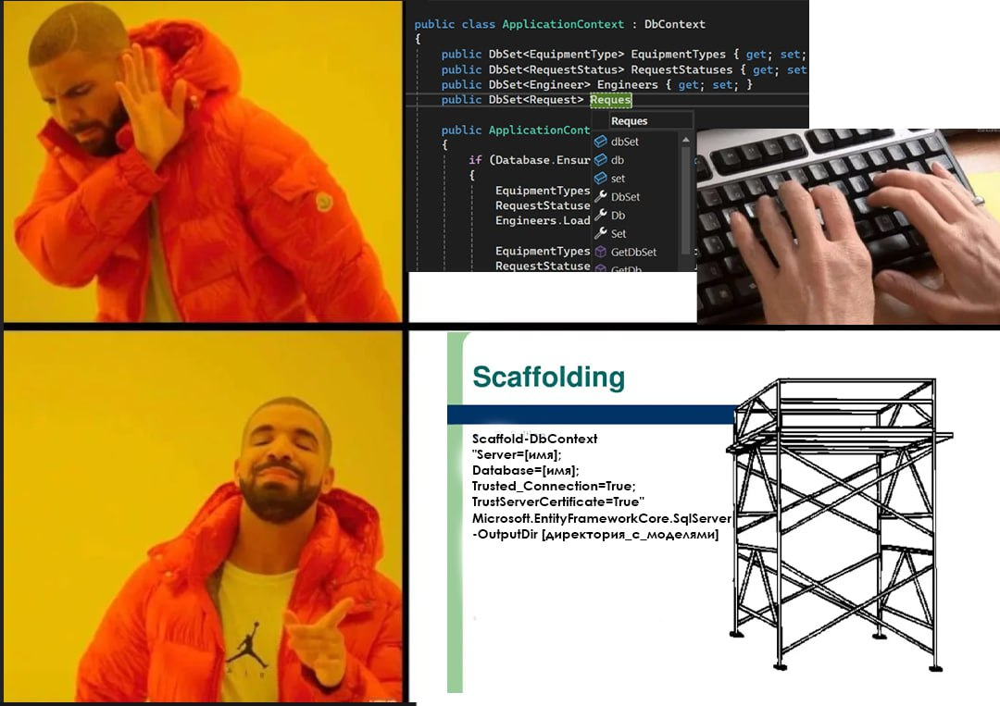

---

Создаем или открываем проект в Visual Studio.

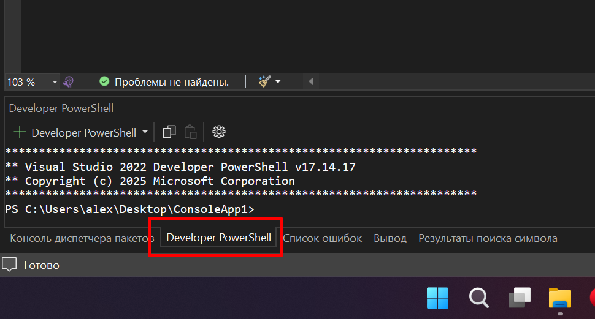

Далее переходим во вкладку "Developer PowerShell"

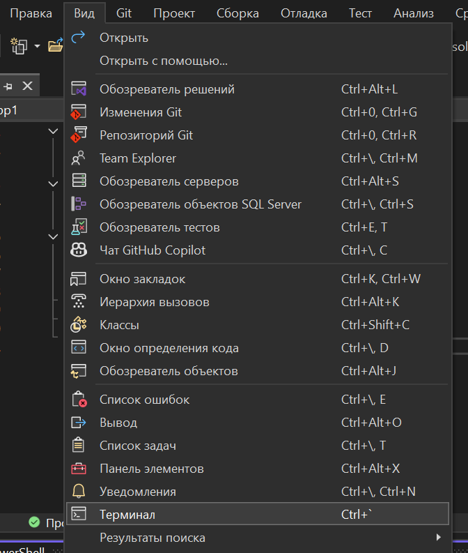

(Если такой нет, можно открыть её здесь)

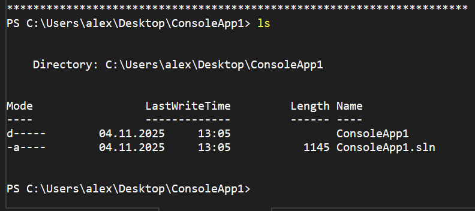

Далее пишем `ls`, чтобы получить список файлов в текущей директории.

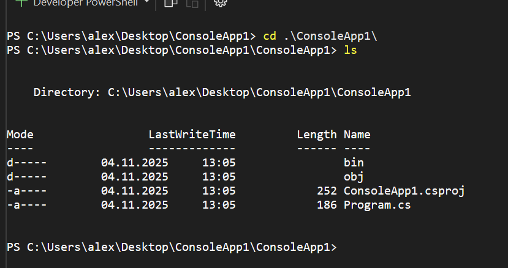

Переходим в папку проекта при помощи `cd <НАЗВАНИЕ_ПАПКИ>` (треугольные скобки не пишутся).

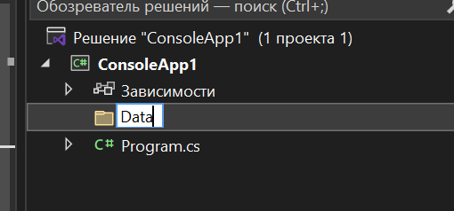

Создаем в корне проекта папку Data. Туда потом мы перенесем ApplicationContext и модели, которые создадутся автоматически.

Далее в PowerShell пишем следующее:
```
dotnet tool install --global dotnet-ef
```
Таким образом мы скачиваем необходимые инструменты для переноса БД.

Потом там же пишем:
```
dotnet ef dbcontext scaffold "Server=<ИМЯ_СЕРВЕРА>; Database=<НАЗВАНИЕ_БД>; Trusted_Connection=True; TrustServerCertificate=True" Microsoft.EntityFrameworkCore.SqlServer
```

Заменяем `<ИМЯ_СЕРВЕРА>` и `<НАЗВАНИЕ_БД>` на свои названия.

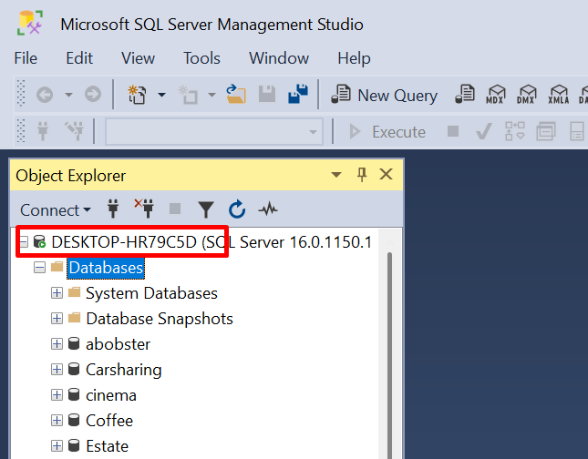
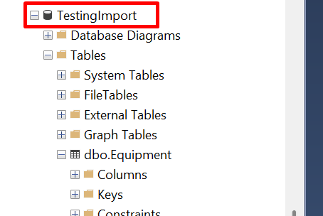

Название сервера и БД можно посмотреть здесь.

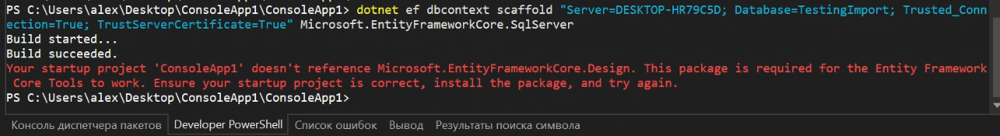

После выполнения команды мы можем увидеть, что нихрена не получилось 👍. Мы не доустановили все нужное.

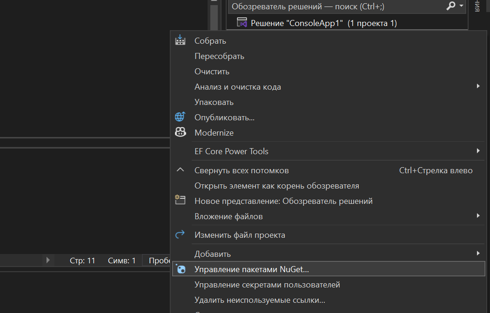

Тыкаем ПКМ по проекту и идем в "Управление пакетами NuGet..."


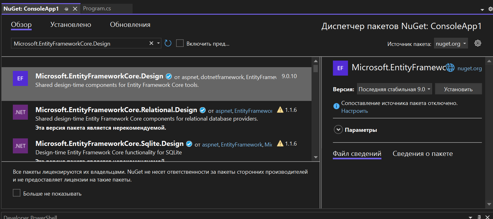

Переходим в "Обзор" и ищем `Microsoft.EntityFrameworkCore.Design`. Устанавливаем.

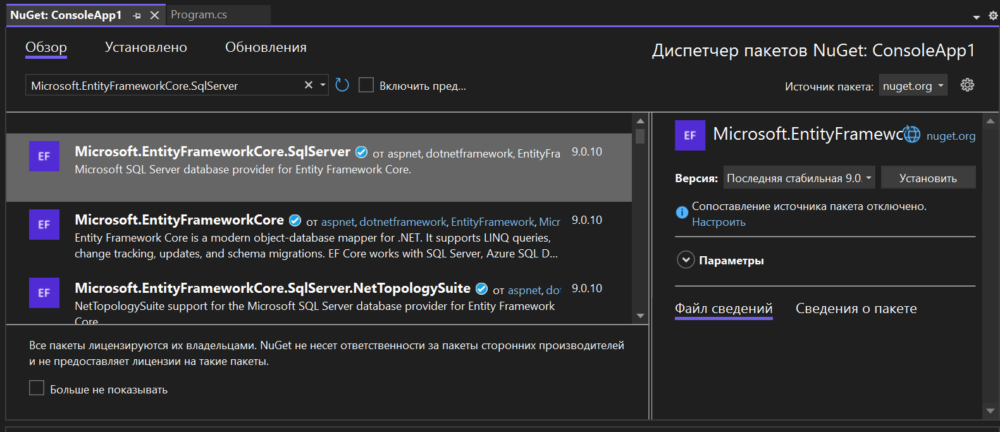

Также устанавливаем `Microsoft.EntityFrameworkCore.SqlServer`.

Будут появляться всякие всплывающие окна, на все соглашаемся. Когда все было установлено, перезапускаем Visual Studio.

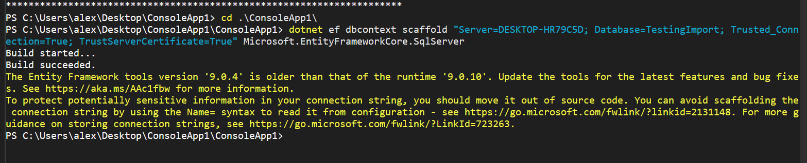

Выполняем ту команду ещё раз, и теперь все получилось.

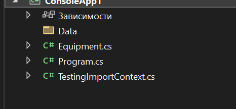

У нас создались файлы. TestingImportContext - это наш DbContext для БД TestingImport, а Equipment - модель для таблицы Equipment. У вас может быть больше файлов. У меня всего один файл модели таблицы, потому что я ленивый и не стал импортировать больше.

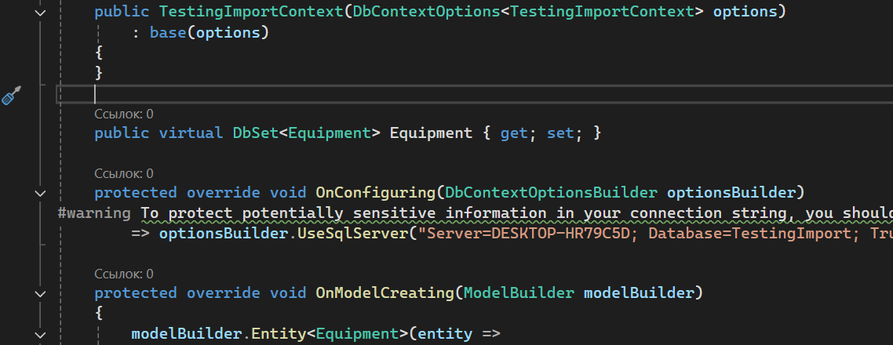

Посмотрим внутрь TestingImportContext. Там уже все необходимое за нас прописали. Так же имеется конструктор, куда мы можем прописать нужный нам код, который будет выполняться при создании экземпляра DbContext.

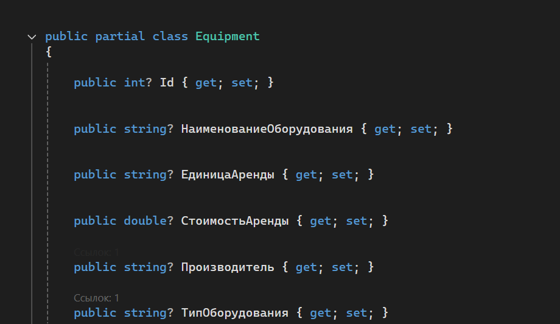

В самих моделях тоже все правильно оформлено. Единственное, названия свойств на русском. Это плохо.

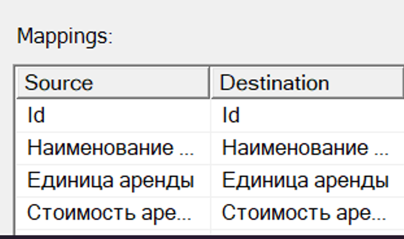

При импортировании данных следует указывать в "Destination" названия на английском.

Можем перенести все эти файлы, которые создались автоматически, в нашу папку Data и в принципе, на этом все.